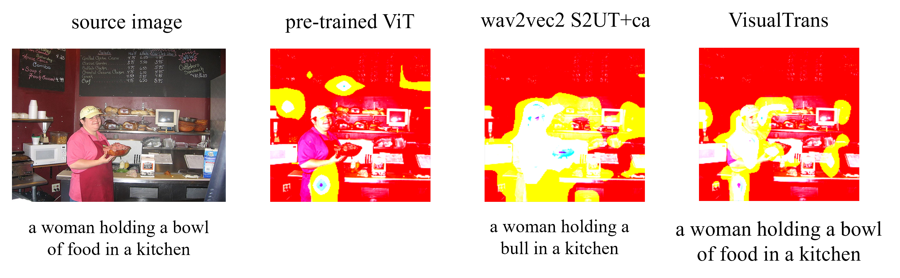
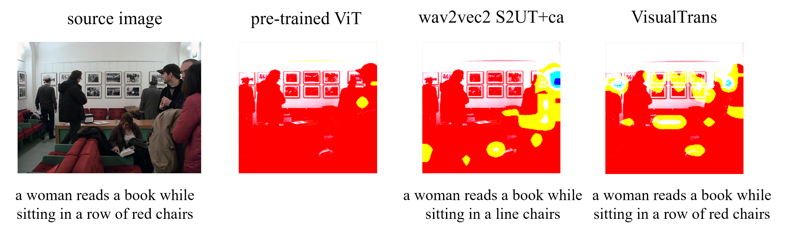
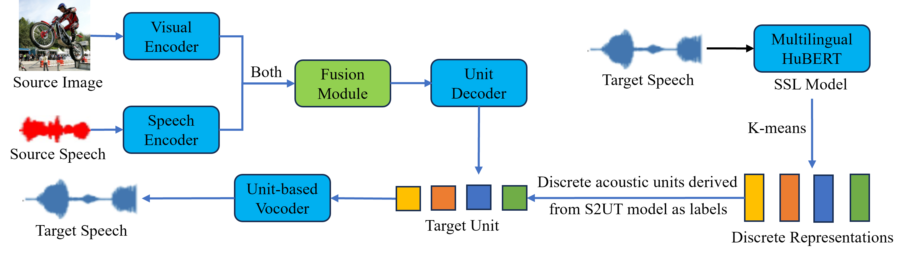
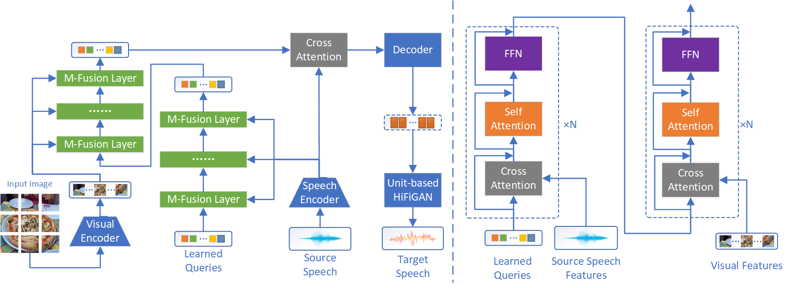

# Multimodal Speech-to-Unit Translation (MM-S2UT)


<div align="center">
**An End-to-End Speech-to-Speech Translation System Based on Multimodal Fusion**
</div>

## 👥 Team & Acknowledgments

* **[Haoxiang Wu](https://github.com/your-id)** – Master Student @ [Zhejiang University](https://www.zju.edu.cn/english/)
* **[Wenrui Liu](https://github.com/wenrui-id)** – PhD Student @ [Zhejiang University](https://www.zju.edu.cn/english/)
* **[Xiyan Jiang](https://github.com/xiyan-id)** – Master Student @ [Zhejiang University](https://www.zju.edu.cn/english/)

---

## 📖 Overview

**Textless Speech-to-Speech Translation (S2ST)**, which directly converts speech from one language to another without intermediate text, struggles with data scarcity. Audio-visual S2ST models enhance performance by integrating visual information, particularly in low-resource or noisy scenarios. However, both speech and visual representations often contain redundant information, which can interfere during the fusion process and degrade translation performance. Therefore, we propose **VisualTrans**, a novel framework that introduces an information bottleneck module to filter redundant information from both speech and visual representations, thereby mitigating their negative impact on translation results. Additionally, we introduce the **Speech Multi30K dataset**, comprising parallel speech-text pairs and corresponding images. Experiments demonstrate that VisualTrans outperforms baseline models, achieving an average improvement of **1.04 BLEU** **points** and enhancing robustness even in noisy environments.

To gain a deeper understanding of which areas in the images the model's visual encoders focus on, we select the visual encoders from **pretrained ViT**, **wav2vec2 S2UT+ca**, and **VisualTrans** to analyze their heatmaps for a set of example images. In the heatmaps, the importance of each pixel is represented by varying brightness or colors, with brighter or darker regions indicating that the model is placing greater attention or assigning higher weights.





While cross attention can integrate information from speech and images, it does not effectively assist speech translation with images. **VisualTrans** implicitly aligns speech and visual features, and supplements deficient or erroneous information in the speech with aligned visual features, leading to more accurate speech translation.

---

## ✨ Features

- **Multimodal speech translation** with audio + image joint input
- **Selective attention mechanism** for dynamic multimodal fusion
- **Multiple visual encoders**: ViT, DETR
- **Complete pipeline**: data preprocessing, training, inference, evaluation
- **Modality dropout** for enhanced robustness
- **Distributed training** support
- **Multi-metric evaluation**: BLEU, ASR-BLEU, WER

---

## 🏗️ Project Architecture

### Architecture Overview

**VisualTrans** adopts an encoder-decoder architecture, fusing audio and visual features through selective attention mechanisms:





---

## 🚀 Installation & Setup

### Requirements

- **Operating System**: Linux (Ubuntu 20.04+ recommended)
- **Python Version**: 3.10+
- **CUDA Version**: 12.0+ (Required for GPU training)

All other Python-specific dependencies are listed in `requirements.txt`.

### Setup

#### 1. Clone the Repository

Download the source code to your local machine or server.

#### 2. Environment Setup

You can set up your environment using **pip** or **Conda**. Then create a environment either  install the requirements listed above manually or   using the `requirements.txt` file:

```
pip install -r requirements.txt
```

### Configuration

#### Main Configuration Files

The project provides two main configuration files:

1. **`mm_s2ut/config/multimodal_s2ut_transformer.yaml`**
   - Complete configuration for multimodal speech translation
   - Includes visual encoder, fusion strategy, and other parameters
2. **`mm_s2ut/config/xm_transformer.yaml`**
   - Cross-lingual model configuration

#### Key Configuration Parameters

```yaml
# Selective attention parameters
SA_image_dropout: 0.1          # Image feature dropout rate
SA_attention_dropout: 0.1      # Attention dropout rate
use_selective_gate: True       # Whether to use selective gating

image_feat_dim: [768]           # Image feature dimension
```

### Data Preparation

```bash
cd mm_s2ut/scripts/preprocess

# Preprocess
jupyter notebook 1_preprocess.ipynb

# Generate manifest
bash 2_manifest.sh

# Cluster speech units
bash 3_cluster.sh

# Prepare S2UT data
bash 5_prep_s2ut_data.sh

# Extract image features
cd ../extract_feature
python get_img_feat_vit.py \
    --model vit_base_patch16_384 \
    --image_dir /path/to/images \
    --output_dir /path/to/output
```

### Training

#### Enhanced Version (Recommended)

```bash
cd mm_s2ut/scripts/enhanced
bash 1_train.sh
```

Example training script:

```bash
#!/bin/bash

# Set environment variables
export CUDA_VISIBLE_DEVICES=0,1,2,3

fairseq-train /path/to/data \
    --config-yaml multimodal_s2ut_transformer.yaml \
    --task multimodal_speech_to_speech \
    --arch mm_s2ut_transformer \
    --criterion speech_to_speech \
    --optimizer adam \
    --lr 0.0001 \
    --max-tokens 40000 \
    --update-freq 2 \
    --max-epoch 100 \
    --save-dir checkpoints/mm_s2ut \
    --log-interval 100 \
    --fp16
```

#### Textless Version

```bash
cd mm_s2ut/scripts/textless
bash 1_train.sh
```

### Inference and Evaluation

```bash
cd mm_s2ut/scripts/enhanced

# Single inference
bash 2_inference.sh

# Batch inference
bash inference_all.sh

# Generate waveform
cd ..
bash 3_generate_waveform.sh

# ASR transcription
python 4_transcript.py \
    --input_dir /path/to/generated/audio \
    --output_file transcripts.txt

# Calculate BLEU
python 5_bleu_asr.py \
    --reference ref.txt \
    --hypothesis hyp.txt
```

---

## 💡 Usage Examples

### Command-Line Inference Example

```bash
# Single sample inference
python -m mm_s2ut.inference \
    --model_path checkpoints/mm_s2ut/checkpoint_best.pt \
    --audio_path examples/audio.wav \
    --image_path examples/image.jpg \
    --output_dir outputs/

# Batch inference
python -m mm_s2ut.inference \
    --model_path checkpoints/mm_s2ut/checkpoint_best.pt \
    --manifest_file data/test.tsv \
    --output_dir outputs/batch/
```

### Python API Example

```python
import torch
from fairseq import checkpoint_utils, tasks
from mm_s2ut.models import MM_S2UTTransformerModel

models, cfg, task = checkpoint_utils.load_model_ensemble_and_task(
    ['checkpoints/mm_s2ut/checkpoint_best.pt']
)
model = models[0].cuda()
model.eval()

audio_path = 'examples/audio.wav'
image_path = 'examples/image.jpg'

sample = task.load_sample(audio_path, image_path)

with torch.no_grad():
    units = model.generate(sample)

waveform = vocoder.generate(units)

import soundfile as sf
sf.write('output.wav', waveform, 16000)
```

### Evaluation Example

```bash
# Calculate ASR-BLEU
python mm_s2ut/scripts/bleu_asr.py \
    --reference_text data/test.en \
    --generated_audio outputs/batch/*.wav \
    --asr_model facebook/wav2vec2-large-960h

# Example output:
# BLEU Score: 28.4
# Detailed Scores:
#   BLEU-1: 52.3
#   BLEU-2: 35.6
#   BLEU-3: 25.8
#   BLEU-4: 28.4

# Calculate WER (Word Error Rate)
python mm_s2ut/scripts/wer.py \
    --reference data/test.txt \
    --hypothesis outputs/transcripts.txt

# Example output:
# WER: 15.2%
# Insertions: 23
# Deletions: 45
# Substitutions: 89
```

Here are some experimental results. These results demonstrate that **VisualTrans** consistently outperforms the **AV-TranSpeech** baseline across all language pairs and datasets, highlighting the superior efficacy of the M-Fusion mechanism in multimodal speech-to-speech translation.

| **Language Pair** | **Model** | **Modality** | **Fuse Method** | **Valid** | **Test.2016** | **Test.2017** | **Test.coco** |
| ----------------------- | --------------- | ------------------ | --------------------- | --------------- | ------------------- | ------------------- | ------------------- |
| **fr → en**      | AV-TranSpeech   | S+V                | addition              | 31.73           | 32.71               | 27.59               | 23.92               |
|                         | VisualTrans     | S+V                | M-Fusion              | 34.52           | 35.63               | 30.29               | 26.94               |
| **en → fr**      | AV-TranSpeech   | S+V                | addition              | 25.41           | 27.03               | 24.17               | 20.26               |
|                         | VisualTrans     | S+V                | M-Fusion              | 26.69           | 27.30               | 25.09               | 21.03               |
| **es → en**      | AV-TranSpeech   | S+V                | addition              | 40.04           | 39.50               | 36.17               | 31.87               |
|                         | VisualTrans     | S+V                | M-Fusion              | 41.94           | 42.64               | 37.34               | 35.02               |
| **en → es**      | AV-TranSpeech   | S+V                | addition              | 55.82           | 58.06               | 50.26               | 48.55               |
|                         | VisualTrans     | S+V                | M-Fusion              | 57.64           | 58.57               | 50.41               | 48.73               |

---

## 🙏 Acknowledgments

This project is built on the following excellent open-source projects:

- [Fairseq](https://github.com/facebookresearch/fairseq) - Sequence-to-sequence toolkit by Meta AI Research
- [Hugging Face Transformers](https://github.com/huggingface/transformers) - Pre-trained model library
- [timm](https://github.com/huggingface/pytorch-image-models) - PyTorch image models library
- [Wav2Vec 2.0](https://arxiv.org/abs/2006.11477) - Self-supervised speech representation learning
- [HuBERT](https://arxiv.org/abs/2106.07447) - Hidden-Unit BERT

Thanks to all contributors for their hard work!
